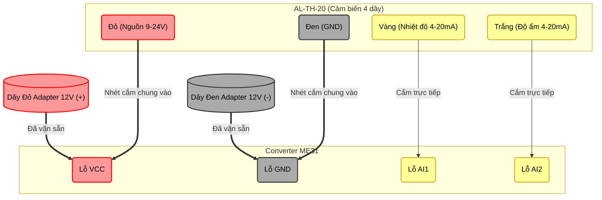

# ⚡ QUICK TEST: Thao tác thuần trên Modbus Tester

Tài liệu này hướng dẫn bạn cách "khám sức khoẻ" cực nhanh toàn bộ cổng giao tiếp của module ME31-AAAX4220 (chỉ sử dụng màn hình **Modbus Tester**, bỏ qua phần tự động hoá). 

Đây là cách dân điện công nghiệp thường dùng để "ping" thiết bị xem sống/chết trước khi cài đặt phần mềm.

---

## 🔧 Chuẩn bị chung
1. Cấp nguồn, cắm cáp USB-to-RS485 vào ME31.
2. Vào **Settings -> Connection**: Chọn đúng Port, set `Baudrate: 9600`, `Data bits: 8`, `Parity: None`, `Stop bits: 1`. Nhấn Save.
3. Chuyển sang màn hình **Modbus Tester** (biểu tượng phích cắm). Các bước dưới đây chỉ thao tác tại màn hình này.

---

## 1. Test DI (Digital Input - Đọc Nút nhấn / Tín hiệu số)
*Mục đích: Xem PC có nhận biết được khi bạn chập mạch (ấn nút) ở cổng DI1 không.*

- **Thiết lập Tool:**
  - Slave ID: `1`
  - Register Type: `Discrete Input` (Mã 0x02)
  - Address: `0` (Địa chỉ của DI1)
  - Count/Length: `1`
  - Data Type: `uint16` (Hoặc boolean nếu tool hỗ trợ)
- **Hành động:**
  - Lấy một sợi dây điện, **chập 2 chân DI1 và COM** của ME31 lại với nhau (giả lập đang bấm nút).
  - Bấm nút **Scan** trên app.
  - Kết quả trả về `1` -> Đọc thành công!
  - Nhả sợi dây ra, bấm **Scan** lần nữa. Kết quả trả về `0` -> Hoàn hảo!

---

## 2. Test DO (Digital Output / Relay - Điều khiển nhị phân)
*Mục đích: Điều khiển PC gửi lệnh "đóng/cắt" cạch cạch cục rơ-le.*

- **Thiết lập Tool:**
  - Slave ID: `1`
  - Register Type: `Coil` (Mã 0x01/0x05)
  - Address: `0` (Địa chỉ của DO1/Relay 1)
  - Count/Length: `1`
- **Hành động:**
  - Trong bảng kết quả bên dưới, tìm ô nhập liệu ở cột **Write Value** (hoặc Operation).
  - Nhập số `1` -> Bấm nút **Write**.
  - **Phần cứng:** Role trên con ME31 kêu *"Tạch"*, đèn LED DO1 sáng lên!
  - Nhập số `0` -> Bấm nút **Write**.
  - **Phần cứng:** Role ngắt, đèn tắt!

---

## 3. Test AI (Analog Input - Đọc Cảm biến dòng mA)
*Mục đích: Đọc số liệu đo thực tế (dấu phẩy động) từ cực AI1.*

- **Thiết lập Tool:**
  - Slave ID: `1`
  - Register Type: `Input Register` (Mã 0x04)
  - Address: `200` (Theo manual, đây là thanh ghi chứa số float của AI1).
  - Count/Length: `2` (Float32 chiếm 2 thanh ghi 16-bit).
  - Data Type: `float32` (Endians: thử `CDAB` hoặc `ABCD`).
- **Hành động:**
  - Cắm nguồn phát dòng (VD: 12.5mA) vào chân AI1 và GND.
  - Bấm nút **Scan**.
  - Bảng kết quả sẽ gộp 2 thanh ghi lại, giải mã và hiển thị con số `12.500`. Đo điện áp/dòng điện chuẩn xác!

---

## 4. Test AO (Analog Output / Holding Registers)
*Lưu ý: Mô-đun ME31 của bạn **chỉ có AI, DI, DO** chứ không có cổng ngõ ra tuyến tính (AO) vật lý (như xuất áp 0-10V). Tuy nhiên, về mặt Modbus, AO đồng nghĩa với việc đọc/ghi thanh ghi cấu hình (Holding Register).*

*Mục đích: Đọc và ghi tham số nội bộ của thiết bị.*

- **Thiết lập Tool:**
  - Slave ID: `1`
  - Register Type: `Holding Register` (Mã 0x03/0x06)
  - Address: `2024` (Hệ Hex là 0x07E8 - Đây là địa chỉ lưu Slave ID hiện tại của module).
  - Count/Length: `1`
  - Data Type: `uint16`
- **Hành động:**
  - Bấm **Scan**.
  - Kết quả trả về `1` (Chính là Slave ID hiện tại của nó).
  - *(Lưu ý: Bạn có thể nhập `2` và bấm Write để đổi Slave ID của module thành 2, nhưng sau khi đổi bạn sẽ mất kết nối nếu không chỉnh lại Slave ID trên App thành 2. Nên để yên test Scan là đủ chứng minh Holding Register hoạt động tốt).*

---

## Bài Test 5: Test Analog Input (AI) với Cảm biến AL-TH-20 (4-20mA)

Bài test này dùng để kiểm tra cổng Analog Input (AI) của ME31 bằng cách kết nối với cảm biến độ ẩm/nhiệt độ AL-TH-20 (loại 4 dây, tín hiệu chủ động 4-20mA).

### Sơ Đồ Đấu Nối Dây (Cấp chung nguồn 12V)

### Các bước đấu dây siêu nhanh (Tận dụng ngay lỗ vặn ốc trên ME31):
Vì 2 dây Đỏ/Đen của cục nguồn cắm tròn đã được bắt vít sẵn vào lỗ `VCC` và `GND` của ME31, bạn làm theo các bước sau (nhớ rút điện trước khi làm):

1. **Cấp nguồn cho Cảm biến:** 
   - Nới lỏng ốc ở lỗ `VCC` của ME31 ra, nhét thêm **dây Đỏ** của cảm biến vào chung lỗ đó với dây đỏ của nguồn rồi vặn chặt lại. (Lỗ VCC giờ có 2 dây).
   - Nới lỏng ốc ở lỗ `GND` của ME31 ra, nhét thêm **dây Đen** của cảm biến vào chung lỗ đó với dây đen của nguồn rồi vặn chặt lại. (Lỗ GND giờ có 2 dây).
   *(ME31 đã kết nối sẵn đường GND âm của các cổng AI ở bên trong bo mạch nên bạn KHÔNG CẦN bất kỳ dây Jumper nào cả!)*
2. **Cắm dây tín hiệu:** 
   - Cắm dây **Vàng** vào lỗ **`AI1`**.
   - Cắm dây **Trắng** vào lỗ **`AI2`**. 
   - Cấp điện Adapter!

### Tiến hành Test trên App
- **Chế độ:** `Read Mode`
- **Cấu hình UI:**
  - Register Type: `Input Registers`
  - Data Type: `int16`
  - Start address: `0` (Kênh AI1)
  - End address: `1` (Kênh AI2)
- **Hành động:**
  - Bấm **Scan range**.
  - Kết quả trả về trong khoảng từ `4000` đến `20000` (tương ứng 4mA đến 20mA). 
  - *Mẹo: Thử hà hơi vào cảm biến để xem giá trị độ ẩm tăng lên theo thời gian thực!*
