# 2. Phân tích hệ thống

Từ các yêu cầu nguyên lý và kinh nghiệm bóc tách mã nguồn tại giai đoạn 1, hệ thống ứng dụng Data Logger được phân tích và bóc rã thành các luồng chi tiết. Việc thiết kế các biểu đồ phân tích rõ ràng sẽ phân định ranh giới hoạt động của các Thread, chống xung đột biến tham chiếu chung.

## 2.1 Sơ đồ Phân rã Chức năng (BFD - Business Function Diagram)

Hệ thống Data Logger được nhóm thành 4 module (nhóm cụm) chức năng cốt lõi:

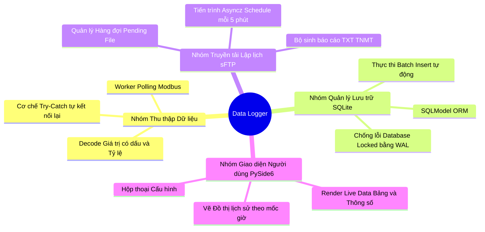

## 2.2 Sơ đồ Luồng Dữ liệu (DFD - Data Flow Diagram)

Sơ đồ được thiết kế tuân thủ nghiêm ngặt **Quy tắc vẽ DFD chuẩn (Gane & Sarson notation)**. Nhằm trực quan hóa, bộ ký hiệu được cung cấp dưới dạng biểu đồ sau:

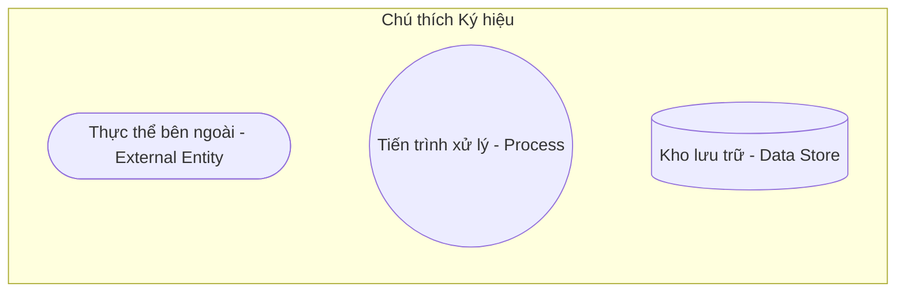

### DFD Mức Context (Level 0 - Toàn cảnh hệ thống)
Mô tả hệ thống bằng duy nhất 1 Process lớn bao trùm (0.0), chỉ kết nối với các Thực thể cấu thành bên ngoài (External Entities).

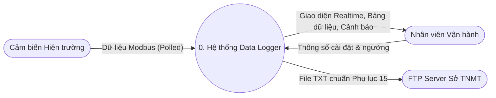

### DFD Mức 1 (Phân rã chức năng)
Phá vỡ hệ thống 0.0 phía trên thành 4 Process chức năng cốt lõi. Số lượng và nội dung mũi tên trỏ ra/vào hệ thống được **Cân bằng (Balancing)** tuyệt đối so với Mức 0.

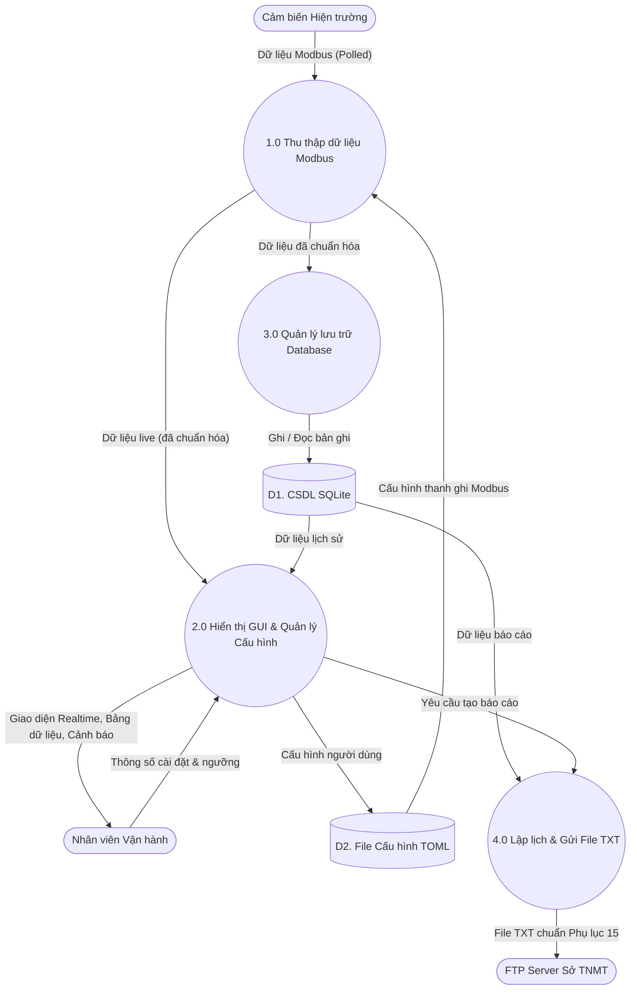

### DFD Mức 2 (Phân rã Process 1.0 - Cơ chế Polling)
Phân rã chi tiết quá trình `1.0 Thu thập dữ liệu Modbus` nhằm phân chia rõ công việc cho Worker. Các luồng (Flows) và thực thể kế thừa hoàn toàn từ Level 1.

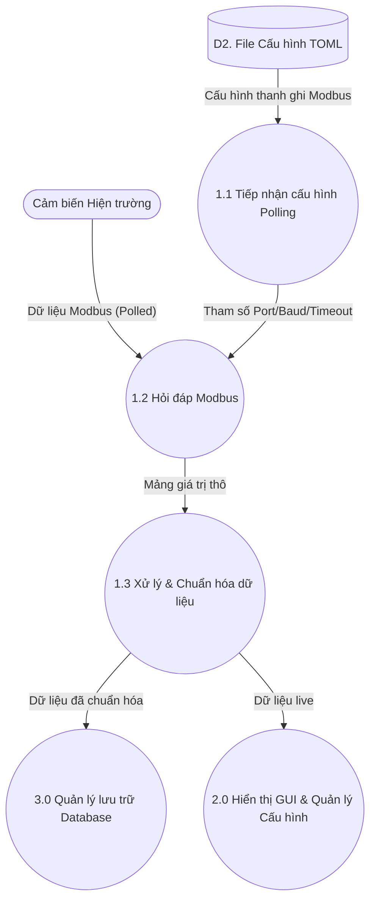

### DFD Mức 2 (Phân rã Process 2.0 - Giao diện và Cấu hình)
Phân rã chi tiết quá trình `2.0 Nạp UI & Cấu hình môi trường`. Các luồng biên kế thừa hoàn toàn từ Level 1.

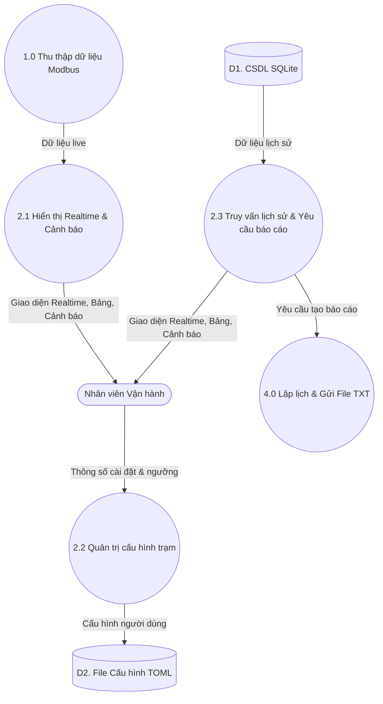

### DFD Mức 2 (Phân rã Process 3.0 - Lưu trữ Database)
Phân rã chi tiết quá trình `3.0 Quản lý lưu trữ Database`. Process này chịu trách nhiệm gom dữ liệu từ hàng chờ và ghi theo lô xuống SQLite.

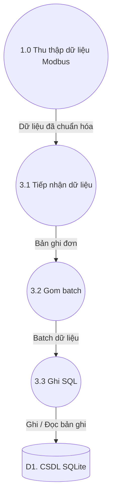

### DFD Mức 2 (Phân rã Process 4.0 - Kết xuất sFTP)
Phân rã chi tiết quá trình `4.0 Kết xuất và gửi sFTP`. Đây là tiến trình lập lịch chạy ngầm qua vòng lặp định kỳ, chịu trách nhiệm sinh file báo cáo và đẩy lên máy chủ Sở TNMT.

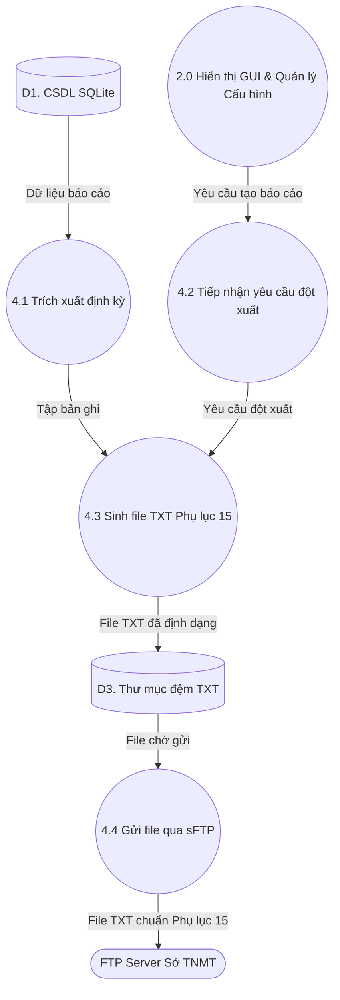

## 2.3 Sơ đồ Hoạt động (Activity Diagram: Vòng lặp Core Kháng lỗi)

Đây là điểm chốt yếu được đúc kết từ repo tham chiếu `Victron_Modbus_TCP` (tên repo — không ám chỉ bắt buộc dùng TCP trong ứng dụng này). **Code data-logger hiện tại chỉ Modbus RTU** (serial); Modbus TCP có thể bổ sung sau. Tiến trình thu thập dữ liệu là xương sống, phải bao bọc được mọi loại rủi ro nhiễu đường truyền.

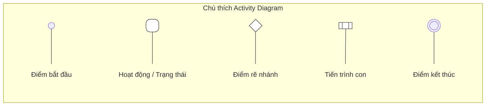

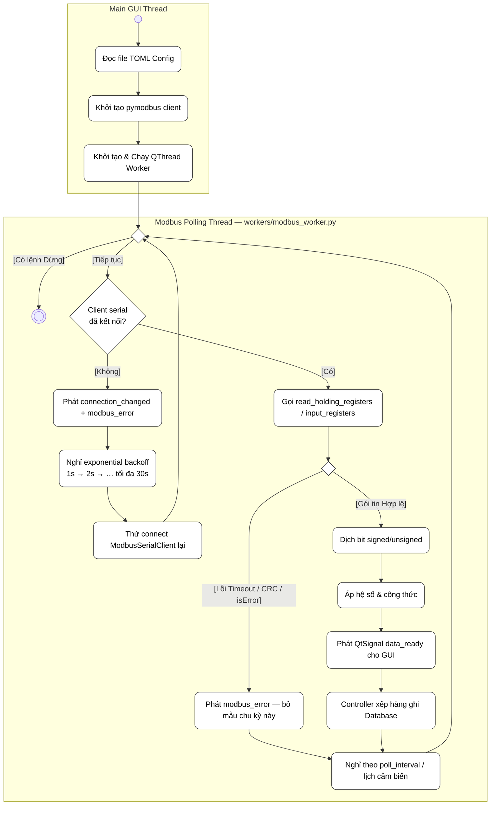

**Khớp triển khai:** không có biến đếm “retry ≤ 3”. **Mất kết nối serial:** thử lại **không giới hạn số lần**, chỉ tăng **thời gian chờ** (nhân đôi, trần 30s) rồi `connect()` lại. **Lỗi một frame đọc:** báo `modbus_error`, không retry tức thì; lần đọc kế tiếp theo **chu kỳ poll** của cảm biến (hành vi tự nhiên “thử lại theo thời gian”, không cần đếm 1–2–3).

## 2.4 Cấu trúc Máy Trạng thái Giao diện (System State Machine)

Trạng thái toàn cục (State) của thiết bị trên màn hình PySide6 được thiết kế dựa trên các mode (IDLE, OK, ERR) và hiển thị màu sắc tương ứng:

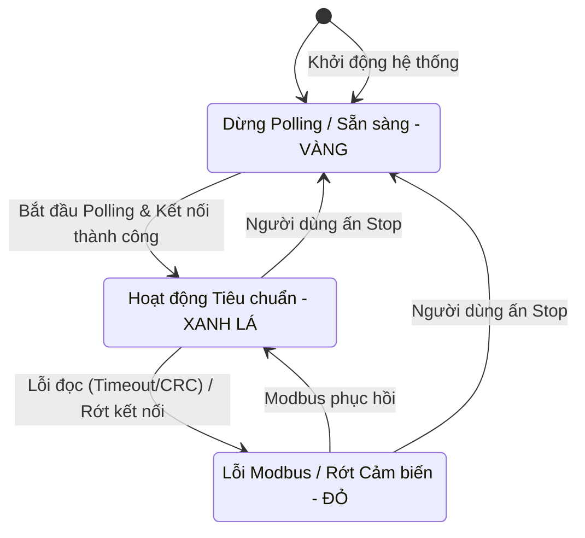

**Giải thích các trạng thái:**
- **Dừng Polling (VÀNG)**: `STATUS_IDLE`. Ứng dụng ở trạng thái chờ lệnh, không thu thập dữ liệu Modbus.
- **Hoạt động Tiêu chuẩn (XANH LÁ)**: `STATUS_OK`. Đang polling liên tục và kết nối ổn định. Bảng dữ liệu được update realtime.
- **Lỗi Modbus (ĐỎ)**: `STATUS_ERR`. Không nhận được data từ cảm biến hoặc mất kết nối serial. Giao diện báo lỗi nhưng luồng worker vẫn tiếp tục retry vòng lặp (backoff).

## 2.5 Đặc tả Ràng buộc Dữ liệu Lõi (Database Integrity)

Dựa trên cấu trúc Phân tích DFD này, thiết kế của SQLite (chạy DB Model thông qua SQLModel) không còn là đồ chơi mà mang tính công nghiệp thực thụ. 
Ứng dụng sẽ kích hoạt cứng dòng lệnh `PRAGMA journal_mode = WAL` (Write-Ahead Logging). Với kiến trúc phân nhánh của DFD phía trên, Luồng `DB_Worker` có thể thoải mái thực hiện hàng loạt tác vụ `INSERT INTO` ở nền, mà hoàn toàn không gây cản trở rủi ro Lock DB khi Luồng `FTP_Worker` vẫn đang chiếm quyền `SELECT` để xuất data sinh báo cáo thời gian thực, hay user đang bấm xem thống kê tháng.
