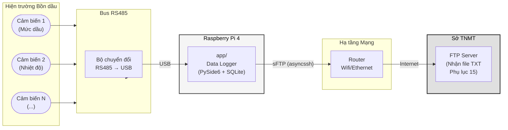
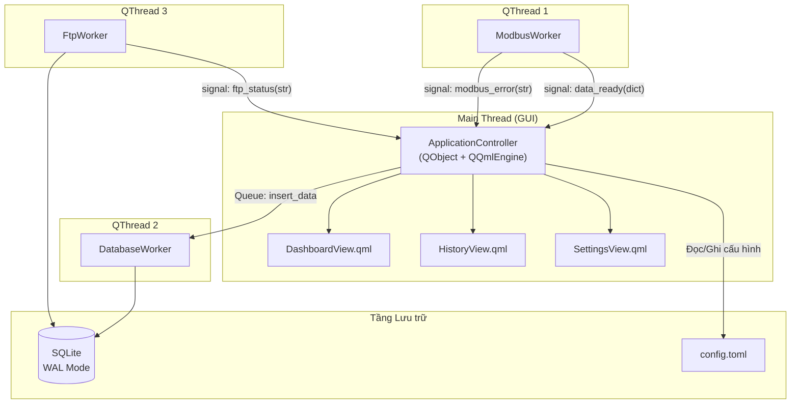
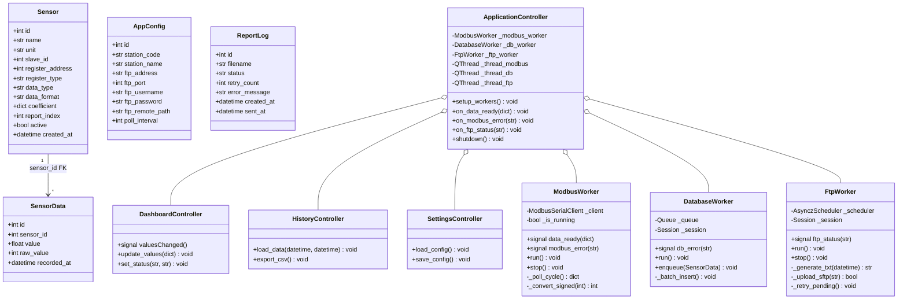
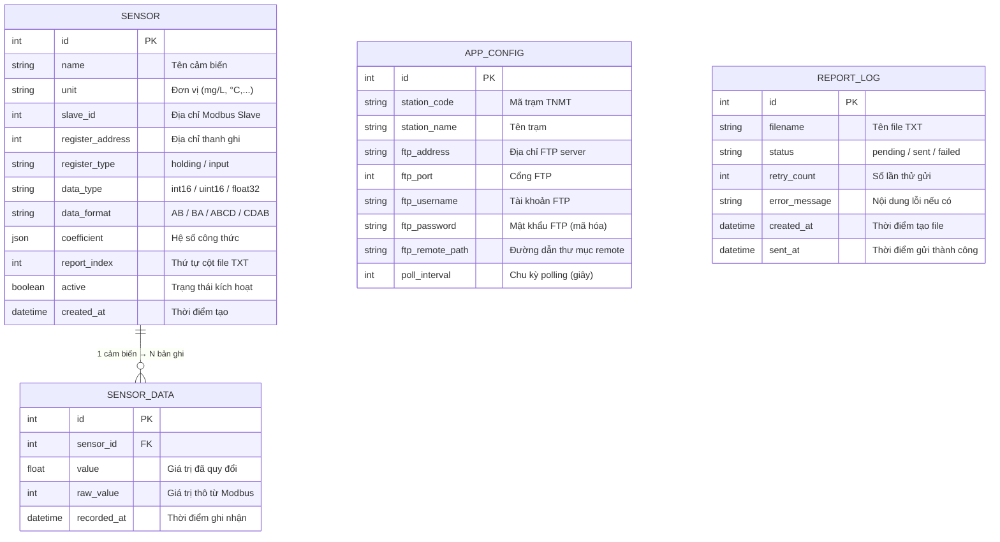
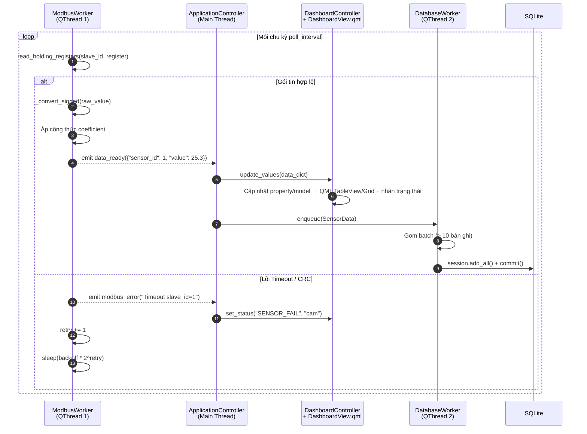
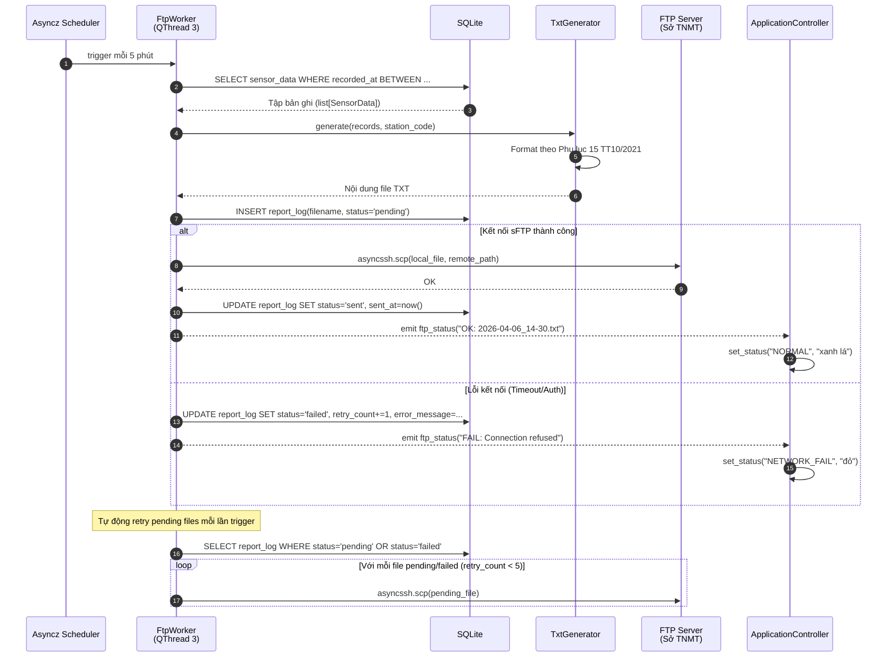

# 3. Thiết kế Hệ thống

Từ kết quả phân tích DFD, Activity Diagram và State Machine ở Bước 2, chương này cụ thể hóa kiến trúc phần mềm thành các lớp đối tượng (Class), lược đồ cơ sở dữ liệu (Database Schema) và luồng giao tiếp đa luồng (Multi-threading Sequence) sẵn sàng cho việc lập trình.

## 3.1 Kiến trúc Tổng thể & Sơ đồ Triển khai (Deployment Diagram)

### Sơ đồ Triển khai Vật lý

Mô tả kết nối phần cứng thực tế tại hiện trường bồn dầu:



### Kiến trúc Phần mềm (Architecture Pattern)

Ứng dụng áp dụng song song 2 pattern kiến trúc:

1. **MVC (Model-View-Controller)** cho tầng Giao diện:
   - **Model**: Các class SQLModel (`Sensor`, `SensorData`, `AppConfig`, `ReportLog`)
   - **View**: Các màn hình **QML** (`DashboardView.qml`, `HistoryView.qml`, `SettingsView.qml`, …) — tách biệt khỏi Python
   - **Controller**: Các lớp `QObject` (ví dụ `ApplicationController` điều phối Worker; `DashboardController`, `HistoryController`, `SettingsController` expose `@Slot` / `@Property` cho QML) — nhận Signal từ Worker, cập nhật trạng thái/property để QML binding

2. **Worker Pattern** cho tầng Background:
   - Mỗi tác vụ nền (Modbus Polling, Database Write, FTP Upload) được đóng gói thành một `QObject` Worker chạy trên `QThread` riêng biệt
   - Giao tiếp hoàn toàn qua cơ chế **Qt Signals/Slots** (thread-safe), tuyệt đối không dùng biến toàn cục chia sẻ



> [!NOTE]
> **Giải thích về SQLite WAL Mode trong Kiến trúc Đa luồng:**
> Trong một ứng dụng đa luồng, khi `ModbusWorker` liên tục ghi dữ liệu (INSERT) vào DB, chế độ mặc định của SQLite sẽ khóa cứng file (Lock). Điều này khiến luồng giao diện QML / `ApplicationController` khi truy vấn (SELECT) để xem lịch sử sẽ bị treo, văng lỗi `database is locked`.  
> Khắc phục: **WAL (Write-Ahead Logging)** cho phép luồng Đọc và Ghi hoạt động hoàn toàn độc lập với nhau. `ModbusWorker` ghi ở background, trong khi giao diện người dùng vẫn thoải mái truy xuất dữ liệu mượt mà mà không lo bị nghẽn. (Cơ chế này được cấu hình cứng bằng mã lệnh `PRAGMA` ở mục 3.3.3).

### Cấu trúc Thư mục Dự án (`app/`)

Toàn bộ mã nguồn ứng dụng Data Logger được gom vào một thư mục duy nhất `app/`, loại bỏ hoàn toàn sự phân mảnh `cloud/` và `local/` của kiến trúc cũ.

```
app/
├── main.py                  # Entry point: QGuiApplication + QQmlApplicationEngine
├── models/                  # Tầng Model (SQLModel ORM)
│   ├── __init__.py
│   ├── sensor.py            # Bảng Sensor
│   ├── sensor_data.py       # Bảng SensorData
│   ├── app_config.py        # Bảng AppConfig
│   └── report_log.py        # Bảng ReportLog
├── workers/                 # Tầng Background Worker (QThread)
│   ├── __init__.py
│   ├── modbus_worker.py     # Vòng lặp Polling Modbus
│   ├── database_worker.py   # Gom batch & ghi SQLite
│   └── ftp_worker.py        # Lập lịch & đẩy sFTP
├── ui/
│   ├── qml/                 # Giao diện QML (View)
│   │   ├── Main.qml
│   │   ├── DashboardView.qml
│   │   ├── HistoryView.qml
│   │   ├── SettingsView.qml
│   │   └── TesterView.qml
│   └── *_controller.py      # QObject: Slot/Property cho QML (Controller)
├── core/                    # Logic nghiệp vụ
│   ├── __init__.py
│   ├── database.py          # Engine SQLite, PRAGMA, Session
│   ├── formula.py           # Công thức chuyển đổi giá trị
│   └── txt_generator.py     # Sinh file TXT Phụ lục 15
├── config/
│   └── settings.toml        # File cấu hình TOML
└── pyproject.toml           # Quản lý bởi uv
```

---

## 3.2 Sơ đồ Lớp (Class Diagram)

Sơ đồ lớp dưới đây mô tả toàn bộ kiến trúc OOP của ứng dụng, chia thành 3 nhóm: **Database Models**, **Background Workers** và **QML bridge (QObject Controllers)** — giao diện cụ thể nằm trong file `.qml`, không dùng Qt Widgets.



**Ánh xạ Class → DFD Process:**

| DFD Process (Bước 2) | Class triển khai |
|---|---|
| 1.0 Thu thập dữ liệu Modbus | `ModbusWorker` |
| 2.0 Hiển thị GUI & Quản lý Cấu hình | `ApplicationController`, `DashboardController`, `HistoryController`, `SettingsController` + QML `DashboardView` / `HistoryView` / `SettingsView` |
| 3.0 Quản lý lưu trữ Database | `DatabaseWorker` |
| 4.0 Lập lịch & Gửi File TXT | `FtpWorker` |

---

## 3.3 Thiết kế Cơ sở Dữ liệu (SQLite Schema)

### 3.3.1 Sơ đồ Thực thể Quan hệ (ER Diagram)



### 3.3.2 Mã Python SQLModel (Database Models)

Dưới đây là mã nguồn hoàn chỉnh cho 4 bảng Database, viết bằng SQLModel (kế thừa cả SQLAlchemy ORM lẫn Pydantic validation):

#### Bảng `Sensor`
```python
from sqlmodel import SQLModel, Field
from typing import Optional
from datetime import datetime


class Sensor(SQLModel, table=True):
    """Cấu hình cảm biến Modbus & thông tin xuất báo cáo."""
    __tablename__ = "sensor"

    id: Optional[int] = Field(default=None, primary_key=True)
    name: str = Field(index=True, description="Tên cảm biến (VD: Mức dầu)")
    unit: str = Field(description="Đơn vị đo (mg/L, °C, m,...)")

    # === Cấu hình Modbus ===
    slave_id: int = Field(description="Địa chỉ Slave trên bus RS485")
    register_address: int = Field(description="Địa chỉ thanh ghi bắt đầu")
    register_type: str = Field(
        default="holding",
        description="Loại thanh ghi: 'holding' hoặc 'input'"
    )
    data_type: str = Field(
        default="int16",
        description="Kiểu dữ liệu: int16 / uint16 / float32"
    )
    data_format: str = Field(
        default="AB",
        description="Thứ tự byte (Endianness): AB / BA / ABCD / CDAB"
    )

    # === Công thức quy đổi ===
    coefficient: dict = Field(
        default={},
        sa_column_kwargs={"type_": "JSON"},
        description="Hệ số công thức: {'a': 1.0, 'b': 0.0} → y = ax + b"
    )

    # === Báo cáo TT10 ===
    report_index: int = Field(
        default=0,
        description="Thứ tự cột khi xuất file TXT Phụ lục 15"
    )

    active: bool = Field(default=True)
    created_at: datetime = Field(default_factory=datetime.now)
```

#### Bảng `SensorData`
```python
from sqlmodel import SQLModel, Field
from typing import Optional
from datetime import datetime


class SensorData(SQLModel, table=True):
    """Dữ liệu quan trắc realtime, ghi nhận theo chu kỳ polling."""
    __tablename__ = "sensor_data"

    id: Optional[int] = Field(default=None, primary_key=True)
    sensor_id: int = Field(foreign_key="sensor.id", index=True)
    value: Optional[float] = Field(
        default=None, description="Giá trị đã quy đổi qua công thức"
    )
    raw_value: Optional[int] = Field(
        default=None, description="Giá trị thô đọc từ thanh ghi Modbus"
    )
    recorded_at: datetime = Field(
        default_factory=datetime.now,
        index=True,
        description="Thời điểm ghi nhận (dùng để truy vấn lịch sử)"
    )
```

#### Bảng `AppConfig`
```python
from sqlmodel import SQLModel, Field
from typing import Optional


class AppConfig(SQLModel, table=True):
    """Cấu hình toàn cục của trạm (chỉ 1 dòng duy nhất trong DB)."""
    __tablename__ = "app_config"

    id: Optional[int] = Field(default=None, primary_key=True)

    # === Thông tin Trạm ===
    station_code: str = Field(description="Mã trạm theo quy định Sở TNMT")
    station_name: str = Field(description="Tên trạm quan trắc")

    # === Cấu hình FTP ===
    ftp_address: str = Field(default="", description="Địa chỉ FTP Server")
    ftp_port: int = Field(default=22, description="Cổng kết nối (22 cho sFTP)")
    ftp_username: str = Field(default="", description="Tài khoản đăng nhập")
    ftp_password: str = Field(default="", description="Mật khẩu (nên mã hóa)")
    ftp_remote_path: str = Field(
        default="/", description="Đường dẫn thư mục trên FTP server"
    )

    # === Cấu hình Polling ===
    poll_interval: int = Field(
        default=3, description="Chu kỳ đọc Modbus (giây)"
    )
```

#### Bảng `ReportLog`
```python
from sqlmodel import SQLModel, Field
from typing import Optional
from datetime import datetime


class ReportLog(SQLModel, table=True):
    """Nhật ký gửi file báo cáo TXT, lưu lịch sử chi tiết từng lần."""
    __tablename__ = "report_log"

    id: Optional[int] = Field(default=None, primary_key=True)
    filename: str = Field(
        index=True, description="Tên file TXT (VD: 2026-04-06_14-30.txt)"
    )
    status: str = Field(
        default="pending",
        description="Trạng thái: pending / sent / failed"
    )
    retry_count: int = Field(
        default=0, description="Số lần đã thử gửi"
    )
    error_message: Optional[str] = Field(
        default=None, description="Nội dung lỗi chi tiết của lần gửi gần nhất"
    )
    created_at: datetime = Field(
        default_factory=datetime.now,
        description="Thời điểm tạo file TXT"
    )
    sent_at: Optional[datetime] = Field(
        default=None, description="Thời điểm gửi thành công"
    )
```

### 3.3.3 Khởi tạo Engine & Cấu hình PRAGMA

Module `core/database.py` chịu trách nhiệm tạo Engine SQLite với các cấu hình PRAGMA bắt buộc cho môi trường công nghiệp 24/7:

```python
from sqlmodel import SQLModel, create_engine, Session
from sqlalchemy import event

DATABASE_URL = "sqlite:///data/datalogger.db"

engine = create_engine(
    DATABASE_URL,
    echo=False,
    connect_args={"check_same_thread": False}  # Cho phép đa luồng
)


@event.listens_for(engine, "connect")
def set_sqlite_pragma(dbapi_connection, connection_record):
    """Thiết lập PRAGMA cứng mỗi lần mở kết nối SQLite."""
    cursor = dbapi_connection.cursor()

    # WAL: Cho phép đọc/ghi song song (Worker INSERT + GUI SELECT)
    cursor.execute("PRAGMA journal_mode = WAL;")

    # NORMAL: Cân bằng giữa tốc độ và an toàn dữ liệu
    cursor.execute("PRAGMA synchronous = NORMAL;")

    # MEMORY: Dùng RAM cho temp tables, giảm ghi vật lý xuống SSD
    cursor.execute("PRAGMA temp_store = MEMORY;")

    # 8MB cache: Tăng hiệu suất truy vấn lịch sử
    cursor.execute("PRAGMA cache_size = -8000;")

    cursor.close()


def init_db():
    """Tạo toàn bộ bảng nếu chưa tồn tại."""
    SQLModel.metadata.create_all(engine)


def get_session() -> Session:
    """Tạo Session mới cho mỗi tác vụ DB."""
    return Session(engine)
```

### 3.3.4 Chiến lược Index

| Bảng | Cột được Index | Lý do |
|---|---|---|
| `sensor` | `name` | Tìm kiếm nhanh theo tên khi hiển thị UI |
| `sensor_data` | `sensor_id`, `recorded_at` | Truy vấn lịch sử theo cảm biến và khoảng thời gian (WHERE + ORDER BY) |
| `report_log` | `filename` | Tra cứu nhanh trạng thái gửi theo tên file |

---

## 3.4 Sơ đồ Tuần tự (Sequence Diagram)

### 3.4.1 Luồng Polling Modbus → Cập nhật GUI

Mô tả chuỗi sự kiện từ khi Worker đọc dữ liệu Modbus đến khi hiển thị lên Dashboard và lưu vào Database:



### 3.4.2 Luồng Xuất Báo cáo & Gửi sFTP

Mô tả chuỗi sự kiện khi bộ lập lịch Asyncz kích hoạt tiến trình sinh file TXT và đẩy lên FTP Server Sở TNMT:



---

## 3.5 Thiết kế Giao diện Nguyên mẫu (Prototype UI)

Giao diện nguyên mẫu được thiết kế bằng HTML + CSS tĩnh đặt tại file [`prototype_ui.html`](prototype_ui.html), mở trực tiếp trên trình duyệt để xem trước bố cục.

### Đặc tả các Màn hình chính

#### Tab 1: Dashboard (Trang chủ)
| Thành phần | Mô tả |
|---|---|
| **Thanh trạng thái** | Hiển thị tên trạm, mã trạm, trạng thái kết nối (đèn xanh/cam/đỏ) |
| **Bảng Realtime** | `TableView` / lưới card QML hiển thị tất cả cảm biến: Tên, Giá trị, Đơn vị, Thời gian cập nhật (dữ liệu từ `DashboardController` / model) |
| **Đèn cảnh báo** | Thay đổi màu theo State Machine ở Bước 2 (Xanh lá / Cam / Đỏ / Xanh dương) |

#### Tab 2: Lịch sử (History)
| Thành phần | Mô tả |
|---|---|
| **Bộ lọc** | Control chọn khoảng thời gian QML (Từ ngày - Đến ngày; có thể dùng `DatePicker` tùy biến) |
| **Bảng dữ liệu** | `TableView` / `ListView` QML hiển thị dữ liệu lịch sử đã lọc |
| **Nút Export** | Xuất dữ liệu ra file CSV |

#### Tab 3: Cài đặt (Settings)
| Thành phần | Mô tả |
|---|---|
| **Nhóm Trạm** | `TextField` QML: Mã trạm, Tên trạm |
| **Nhóm Modbus** | `SpinBox` / `TextField`: Slave ID, Register Address; `ComboBox`: Register Type, Data Type |
| **Nhóm FTP** | `TextField`: Địa chỉ, Username, Password; `SpinBox`: Port |
| **Nút Lưu** | Ghi toàn bộ cấu hình vào bảng AppConfig |

---

## 3.6 Quy định & Nguyên tắc

### Coding Convention
- **PEP 8**: Tuân thủ tuyệt đối quy tắc đặt tên, thụt lề 4 spaces
- **Type Hints**: Bắt buộc khai báo kiểu cho mọi tham số và giá trị trả về
- **Docstring**: Mọi class và method public phải có docstring mô tả chức năng

### Quy tắc Xử lý Exception

| Tầng | Chiến lược | Ví dụ |
|---|---|---|
| Modbus Worker | `try-except-continue` | Lỗi Timeout → log cảnh báo → tiếp tục vòng lặp |
| Database Worker | `try-except-rollback` | Lỗi INSERT → rollback session → retry |
| FTP Worker | `exponential backoff` | Lỗi kết nối → chờ 2^n giây → retry (tối đa 5 lần) |
| GUI (QML) | `try-except` + Signal tới QML | Lỗi không mong muốn → `Dialog` / `Popup` QML hoặc toast (không dùng QMessageBox Widgets) |

### Quy tắc Logging

```python
import logging
from logging.handlers import TimedRotatingFileHandler

logger = logging.getLogger("datalogger")
handler = TimedRotatingFileHandler(
    "logs/app.log",
    when="midnight",    # Xoay file mỗi ngày
    backupCount=30,     # Giữ 30 ngày log
    encoding="utf-8"
)
handler.setFormatter(logging.Formatter(
    "%(asctime)s | %(levelname)-8s | %(name)s | %(message)s"
))
logger.addHandler(handler)
logger.setLevel(logging.INFO)
```

**Quy tắc cấp độ Log:**
| Level | Khi nào dùng |
|---|---|
| `DEBUG` | Chi tiết giá trị thanh ghi Modbus thô |
| `INFO` | Ghi nhận sự kiện thành công (polling OK, FTP sent) |
| `WARNING` | Timeout Modbus, FTP retry |
| `ERROR` | Lỗi nghiêm trọng (DB locked, FTP auth failed) |
| `CRITICAL` | Lỗi hệ thống không phục hồi được (disk full) |
