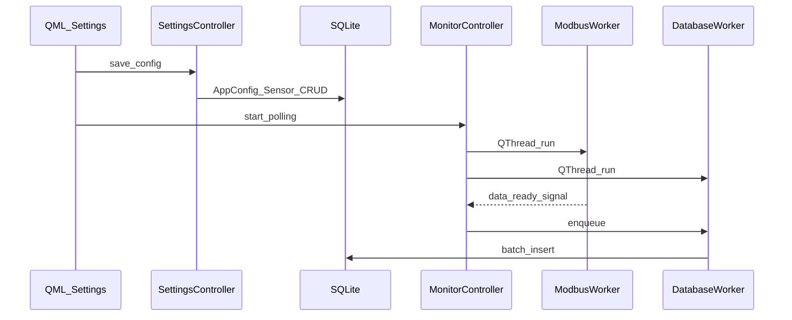
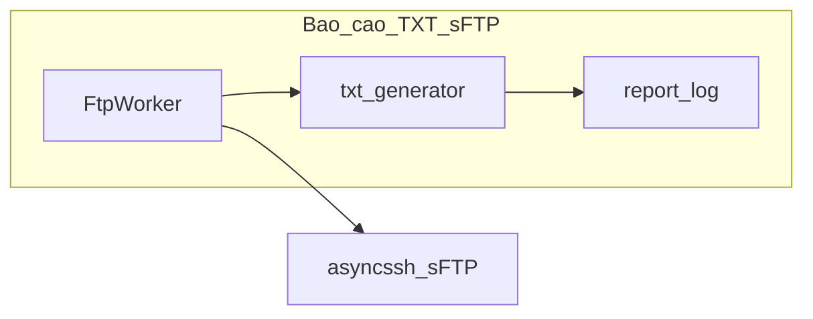

# Báo cáo soát sâu codebase — Data Logger

**Ngày:** 2026-04-17  
**Phạm vi:** `main.py`, `core/`, `models/`, `ui/` (Python + QML), `workers/`, `tests/`, `deploy.sh`, `scripts/`, `i18n/`, [README.md](../../README.md), [pyproject.toml](../../pyproject.toml). Loại trừ `REPO_THAM_KHAO/`, prototype trong `plan/` (không phải app).  
**So sánh:** bổ sung cho [codebase_review_2026-04-17.md](codebase_review_2026-04-17.md) (soát lướt).

**Công cụ:** `ruff check core models ui workers main.py` — **đạt**. `pytest` — **không chạy** (`.venv` hiện tại không cài `pytest`; nên `pip install -e ".[dev]"` trên máy có mạng hoặc chạy trên Pi/CI).

---

## 1. Mapping README → mã chính

| Tính năng (README) | Tab / QML | Python chính |
|--------------------|-----------|--------------|
| Modbus Tester | [ui/qml/TesterView.qml](../../ui/qml/TesterView.qml), [TesterConnectionTab.qml](../../ui/qml/TesterConnectionTab.qml), … | [ui/tester_controller.py](../../ui/tester_controller.py), [core/modbus.py](../../core/modbus.py), [workers/scan_worker.py](../../workers/scan_worker.py) |
| Cài đặt | [SettingsView.qml](../../ui/qml/SettingsView.qml) | [ui/settings_controller.py](../../ui/settings_controller.py), [ui/sensor_model.py](../../ui/sensor_model.py) |
| Monitor | [MonitorView.qml](../../ui/qml/MonitorView.qml), [MonitorTaskBar.qml](../../ui/qml/MonitorTaskBar.qml) | [ui/monitor_controller.py](../../ui/monitor_controller.py), [workers/modbus_worker.py](../../workers/modbus_worker.py), [workers/database_worker.py](../../workers/database_worker.py) |
| Lịch sử | [HistoryView.qml](../../ui/qml/HistoryView.qml), [HistoryTaskBar.qml](../../ui/qml/HistoryTaskBar.qml) | [ui/history_controller.py](../../ui/history_controller.py) |
| Báo cáo / sFTP | [Main.qml](../../ui/qml/Main.qml) (chỉ báo FTP), logic bật từ QML nếu có | [ui/report_controller.py](../../ui/report_controller.py), [workers/ftp_worker.py](../../workers/ftp_worker.py), [core/txt_generator.py](../../core/txt_generator.py) |

---

## 2. Bảng soát theo phần (chi tiết + mức độ)

### Phần 1 — Tài liệu & metadata

| Đã kiểm tra | Finding | Mức độ |
|-------------|---------|--------|
| README deploy vs [deploy.sh](../../deploy.sh) | Bảng lệnh khớp `--quick`, full build, `--install`, uninstall; `DATALOGGER_*` export (khoảng dòng 325+) khớp mô tả `var/`. | Info |
| README vs Pi user | README ví dụ `ssh pi@...`; deploy hỗ trợ `PI_USER` — nhất quán nếu dùng user khác `pi`. | Info |
| [pyproject.toml](../../pyproject.toml) | `dynamic` + [core/_version.py](../../core/_version.py); dependencies khớp stack (PySide6, sqlmodel, pymodbus+serial, pyserial, asyncssh, cryptography). | OK |

### Phần 2 — Entry & đường dẫn

| Đã kiểm tra | Finding | Mức độ |
|-------------|---------|--------|
| [core/_paths.py](../../core/_paths.py) import | `DATA_DIR` / `CONFIG_DIR` / `LOG_DIR` `mkdir` khi import module — chạy **trước** `logging.FileHandler` trong [main.py](../../main.py) (vì import `core._paths` trước `basicConfig`). | OK |
| [main.py](../../main.py) | `init_db()` trước QApplication; `setContextProperty` khớp grep QML (`testerController`, `settingsController`, `sensorModel`, `monitorModel`, `monitorController`, `historyModel`, `historyController`, `reportController`, `i18nBridge`, `appIconUrl`). | OK |
| `aboutToQuit` | `stop_polling_sync`, `stop_reporting` — đủ cho polling + FTP worker. | OK |
| Nuitka + systemd | [scripts/datalogger.service](../../scripts/datalogger.service) chỉ set `DATALOGGER_DATA|CONFIG|LOG`; **không** set `DATALOGGER_QML_DIR` / `DATALOGGER_I18N_DIR`. Binary phải bundle `ui/qml`, `i18n` cạnh executable trong `WorkingDirectory` — đúng khi build chuẩn; nếu thiếu file → load QML/i18n lỗi. | Warning |
| [scripts/datalogger.service](../../scripts/datalogger.service) | `User=pi`, `XAUTHORITY=/home/pi/...` cố định — lệch nếu triển khai `PI_USER` khác `pi` (README có `PI_USER=`). | Warning |
| Placeholder | `Documentation=https://github.com/your-org/data-logger` — placeholder. | Info |

### Phần 3 — Models & database

| Đã kiểm tra | Finding | Mức độ |
|-------------|---------|--------|
| [models/sensor.py](../../models/sensor.py) | `report_index` default 0; [workers/ftp_worker.py](../../workers/ftp_worker.py) lọc `report_index > 0` — đúng: 0 = không đưa vào báo cáo TXT. | OK |
| [core/database.py](../../core/database.py) `_migrate` | Giả định bảng `sensor` tồn tại sau `create_all`; DB hỏng một phần hiếm có thể lỗi tại `get_columns("sensor")`. | Info |
| `_migrate` vs model | Chỉ migrate thêm một số cột `app_config` + `sensor.poll_interval`; cột model khác (nếu thêm sau) cần bổ sung tay vào `_migrate`. | Info |
| WAL + `check_same_thread=False` | Phù hợp GUI + `DatabaseWorker` + `SearchWorker`. | OK |

### Phần 4 — Core nghiệp vụ

| Đã kiểm tra | Finding | Mức độ |
|-------------|---------|--------|
| [core/modbus.py](../../core/modbus.py) | `_normalize_register_type` đồng bộ `holding`/`input` với Tester (nhãn dài). | OK |
| [core/formula.py](../../core/formula.py) | JSON lỗi / format không nhận diện → fallback `float(raw_value)`; đa thức bậc cao có thể overflow — chấp nhận được cho cấu hình thông thường. | Info |
| [core/crypto.py](../../core/crypto.py) | Key `config/secret.key`; quyền file OS không ép trong code — ghi nhận cho hardening Pi. | Info |
| [ui/settings_controller.py](../../ui/settings_controller.py) `ftpPassword` | `decrypt` lỗi → trả về `raw` (có thể là ciphertext) lên UI — khó hiểu cho user, không crash. | Warning |
| [core/txt_generator.py](../../core/txt_generator.py) | Trạng thái `"Binh thuong"` không dấu (theo spec đã chọn); `station_code` rỗng vẫn tạo tên file `_YYYYMMDD_HHMM.txt`. | Info |

### Phần 5 — Workers

| Đã kiểm tra | Finding | Mức độ |
|-------------|---------|--------|
| [workers/modbus_worker.py](../../workers/modbus_worker.py) | Stop flag, backoff, per-sensor `poll_interval`; chỉ RTU (monitor). | OK |
| [workers/database_worker.py](../../workers/database_worker.py) | Batch + timeout flush; `session = None` trước try trong `_batch_insert` (đã an toàn rollback). | OK |
| [workers/ftp_worker.py](../../workers/ftp_worker.py) | Cửa sổ thời gian truy vấn = `self._interval` phút; trùng chu kỳ lặp worker — thiết kế hợp lý; edge: ít mẫu trong window vẫn tạo file nếu có bản ghi. | Info |
| [workers/ftp_worker.py](../../workers/ftp_worker.py) | Early `return` trong try: `finally: session.close()` — không rò session. | OK |
| [workers/ftp_worker.py](../../workers/ftp_worker.py) | `filename = filepath.split("/")[-1]` — ổn trên Pi (Linux). | Info |
| [workers/scan_worker.py](../../workers/scan_worker.py) | `except Exception: pass` khi quét từng địa chỉ — lỗi không lên UI, chỉ giảm `found`. | Warning (UX) |

### Phần 6 — UI Python

| Đã kiểm tra | Finding | Mức độ |
|-------------|---------|--------|
| Controllers | Hầu hết `get_session()` + `try/finally: session.close()` trong các slot đã xem (`settings_controller.load_config`, `sensor_model.refresh`, …). | OK |
| [ui/history_controller.py](../../ui/history_controller.py) `SearchWorker` | `run()`: `session.close()` trong `finally` — ổn. | OK |
| Legacy | [ui/main_window.py](../../ui/main_window.py) + `*_widget.py`: không được `main.py` import; đã deprecated trong docstring `main_window`. | Info |

### Phần 7 — QML

| Đã kiểm tra | Finding | Mức độ |
|-------------|---------|--------|
| Binding tên | Khớp `main.py` context properties (grep `Main.qml`, `SettingsView`, `Monitor*`, `History*`, `Tester*`). | OK |
| [HistoryTaskBar.qml](../../ui/qml/HistoryTaskBar.qml) | `export_csv("/home/pi/data-logger/var/data/" + fname)` — **cứng** user/path; lệch nếu `PI_USER` ≠ `pi` hoặc `PI_BASE_DIR` đổi trong deploy. | Warning |

### Phần 8 — i18n

| Đã kiểm tra | Finding | Mức độ |
|-------------|---------|--------|
| [i18n/data_logger_vi.ts](../../i18n/data_logger_vi.ts) | File có dạng **XML không hợp lệ** (ví dụ `< message >`, `< /source>`, khoảng trắng trong thẻ). `lrelease` chuẩn có thể **từ chối** hoặc bỏ qua message. | **Blocking** (chất lượng i18n / build) |
| Khớp chuỗi | [Main.qml](../../ui/qml/Main.qml): `qsTr("FTP (%1 pending)")` trong `.ts` có biến thể khác (`FTP(% 1 pending)` trong nội dung đã xem) — dịch có thể không khớp context. | Warning |
| [ui/i18n_bridge.py](../../ui/i18n_bridge.py) | `install_locale` + `retranslate`; thiếu `.qm` → log warning, UI vẫn chạy. | OK |

### Phần 9 — Deploy & service

| Đã kiểm tra | Finding | Mức độ |
|-------------|---------|--------|
| deploy.sh | rsync exclude DB/log hợp lý; tạo `var/{data,config,logs,...}`; export env giống systemd (trừ không set QML/I18N — giống service). | OK |
| Service `ExecStart` | Mặc định binary Nuitka; block Python comment — khớp README “chọn 1 trong 2”. | OK |

### Phần 10 — Tests

| File test | Trọng tâm |
|-----------|-----------|
| [tests/test_m0_foundation.py](../../tests/test_m0_foundation.py) | DB, crypto, formula, model cơ bản |
| [tests/test_m1_modbus_tester.py](../../tests/test_m1_modbus_tester.py) | `core/modbus`, phần cứng tuỳ điều kiện |
| [tests/test_m2_settings.py](../../tests/test_m2_settings.py) | SettingsController, sensor model |
| [tests/test_m3_monitor.py](../../tests/test_m3_monitor.py) | Monitor, ModbusWorker backoff |
| [tests/test_m4_history.py](../../tests/test_m4_history.py) | History |
| [tests/test_m5_report.py](../../tests/test_m5_report.py) | TXT + FtpWorker |
| [tests/test_e2e_app.py](../../tests/test_e2e_app.py) | Khởi động QML/engine (headless tuỳ môi trường) |

**Gap gợi ý:** test tự động cho đường export CSV + path `DATA_DIR`; test `lrelease` / parse `.ts` trên CI; test locale switch không crash.

---

## 3. Luồng nghiệp vụ (rút gọn)

---

## 4. Khuyến nghị ưu tiên

1. **Sửa / tái tạo** [i18n/data_logger_vi.ts](../../i18n/data_logger_vi.ts) bằng `pyside6-lupdate` hoặc `lupdate` hợp lệ, rồi `lrelease` — đảm bảo XML đúng chuẩn Qt.
2. **History export path:** dùng `DATA_DIR` từ Python (context property hoặc slot trả base path) thay vì hardcode `/home/pi/...` trong QML.
3. **systemd:** tham số hoá `User=` / `XAUTHORITY=` theo user deploy, hoặc ghi rõ README “service mẫu cho user `pi`”.
4. **scan_worker:** log debug hoặc đếm lỗi khi đọc thanh ghi thất bại thay vì `pass` im lặng.
5. **settings `ftpPassword`:** khi `decrypt` thất bại, hiển thị placeholder rỗng + log thay vì trả ciphertext.

---

## 5. File đã đọc / grep trực tiếp (không liệt kê hết từng dòng QML)

README, pyproject.toml, main.py, core/_paths.py, core/database.py, core/txt_generator.py, core/modbus.py (đã biết từ trước + alias), workers/ftp_worker.py (đầu), workers/modbus_worker, database_worker, scan_worker (đã biết), ui/settings_controller (đầu), ui/history_controller (đầu), ui/sensor_model (đầu), ui/tester_controller (đầu), ui/i18n_bridge.py, scripts/datalogger.service, deploy.sh (grep DATALOGGER), grep QML controllers, i18n/data_logger_vi.ts (đầu), Main.qml grep FTP.

---

*Báo cáo chỉ quan sát; không thay đổi mã nguồn theo yêu cầu kế hoạch soát sâu.*
