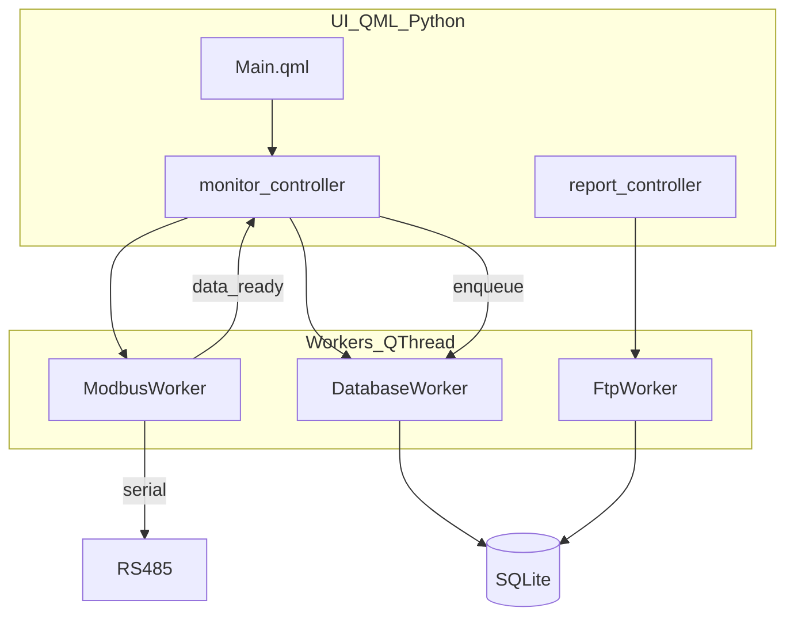

# Báo cáo soát codebase — Data Logger

**Ngày:** 2026-04-17  
**Phương pháp:** README → `pyproject.toml` → `main.py` (+ `core/_paths.py`) → `models/` → `core/` → `ui/` → `workers/`, bổ sung `deploy.sh`, `scripts/datalogger.service`, `tests/`.

---

## Checklist đã thực hiện

| Bước | Kết quả |
|------|---------|
| README | Đối chiếu tính năng, deploy, cấu trúc thư mục |
| pyproject.toml | Dependencies, hatch packages, ruff |
| main.py | Vòng đời Qt/QML, context properties, shutdown |
| models/ | SQLModel: AppConfig, Sensor, SensorData, ReportLog |
| core/ | `_paths`, `database`, `modbus`, `formula`, `crypto`, `txt_generator` |
| ui/ | Controllers, QML entry, binding (đọc mẫu + luồng chính) |
| workers/ | ModbusWorker, DatabaseWorker, FtpWorker, ScanWorker |
| deploy + service + tests | Nhất quán đường dẫn Pi, test matrix |

---

## Điểm mạnh

- **Luồng rõ:** `main.py` khởi tạo DB → locale → đăng ký controller/model lên QML → `aboutToQuit` gọi `stop_polling_sync` và `stop_reporting`.
- **SQLite đa luồng:** `check_same_thread=False`, PRAGMA WAL/sync/cache phù hợp worker + GUI.
- **Migration nhẹ:** `_migrate()` trong [`core/database.py`](../../core/database.py) bổ sung cột khi không dùng Alembic — phù hợp thiết bị nhúng.
- **Đường dẫn Pi:** [`deploy.sh`](../../deploy.sh) export `DATALOGGER_*` trỏ `~/data-logger/var/{data,config,logs}`; [`scripts/datalogger.service`](../../scripts/datalogger.service) cấu hình tương tự cho binary — khớp README về persistent data.
- **Monitor:** `ModbusWorker` + `DatabaseWorker` tách thread; backoff reconnect trong ModbusWorker; batch insert giảm I/O.
- **Kiểm thử:** Thư mục [`tests/`](../../tests/) có `test_m0` … `test_m5` + `test_e2e_app.py` — bao phủ theo module README.

---

## Mâu thuẫn / cảnh báo (theo mức độ)

### Info — phiên bản & tài liệu

- **`pyproject.toml` `version = "1.0.0"`** vs **`main.py` `setApplicationVersion("2.0.0")`** — nên thống nhất một nguồn (package version vs Qt app version).
- **README ví dụ lệnh deploy:** `bash data-logger/deploy.sh` — đúng khi cwd là thư mục cha của repo; trong repo gốc thường là `bash deploy.sh` hoặc `./deploy.sh`.
- **Cấu trúc dữ liệu:** trên Pi production, `deploy.sh`/systemd gán `DATALOGGER_*` → `~/data-logger/var/…`. Code vẫn có đường dẫn mặc định cạnh binary (Nuitka) khi không set biến môi trường — README đã thống nhất **chỉ chạy app trên Pi**, không mô tả chạy production trên máy dev.

### Warning — dependency & bảo mật

- **`bcrypt` trong `pyproject.toml`:** không có import `bcrypt` trong mã nguồn app (có thể dư hoặc dự phòng). Cân nhắc bỏ nếu không dùng để giảm bề mặt phụ thuộc.
- **sFTP [`workers/ftp_worker.py`](../../workers/ftp_worker.py):** `asyncssh.connect(..., known_hosts=None)` — tiện triển khai nhưng tắt xác thực host key; ghi nhận rủi ro MITM trong môi trường nhạy cảm.
- **`FtpWorker._upload_sftp`:** tạo `asyncio.new_event_loop()` mỗi lần upload — chấp nhận được cho tần suất thấp; nếu tăng tần suất có thể cân nhắc tái sử dụng loop.

### Warning — kiểu dữ liệu / API Modbus

- **Sensor model** (`register_type` mặc định `"holding"` / `"input"`) khớp **`ModbusWorker._read_register`**. **`core/modbus.py`** (`ModbusBase.read`) dùng nhãn kiểu **"Holding Register"**, **"Input Register"** — khớp **`ScanWorker`** + tester QML nếu truyền đúng chuỗi. Hai convention song song: cần đảm bảo UI lưu đúng format cho từng luồng (monitor dùng `holding`/`input`).

### Info — code legacy

- **[`ui/main_window.py`](../../ui/main_window.py)** (Widgets + `MonitorWidget`/`ModbusWorker`…): **không** được `main.py` import — app chính là QML. Có thể là đường UI cũ; nếu không dùng nên đánh dấu deprecated hoặc xóa sau khi xác nhận.

### Low — edge case

- **`DatabaseWorker._batch_insert`:** trong `except`, `session.rollback()` giả định `session` đã gán; nếu `get_session()` ném exception trước khi gán, có thể `NameError` (hiếm).

---

## Luồng dữ liệu tóm tắt

---

## Danh sách file đã xem trực tiếp (tham chiếu soát)

- Gốc: `README.md`, `pyproject.toml`, `main.py`, `deploy.sh` (đoạn đầu + grep env)
- `core/`: `_paths.py`, `database.py`, `modbus.py`, `formula.py`, `crypto.py`, `txt_generator.py` (một phần)
- `models/`: `app_config.py`, `sensor.py`, `sensor_data.py`, `report_log.py`
- `workers/`: toàn bộ 4 file worker
- `ui/`: `monitor_controller.py`, `report_controller.py`, `qml/Main.qml` (đoạn đầu)
- `scripts/datalogger.service`
- Grep: `bcrypt`, `main_window`

---

## Gợi ý hành động tiếp theo (tùy ưu tiên)

1. Thống nhất **số phiên bản** giữa `pyproject.toml`, `main.py`, và tài liệu người dùng.
2. Xác minh **`bcrypt`** có cần thiết không; nếu không thì loại khỏi dependencies.
3. Ghi rõ trong README hoặc code comment về **`holding`/`input`** vs **"Holding Register"** để tránh cấu hình sai khi mở rộng tester.
4. Đánh giá **`ui/main_window.py`**: giữ làm fallback hay loại bỏ khỏi wheel package để tránh nhầm lẫn.

---

## Đã xử lý (triển khai sau báo cáo)

| Finding | Cách xử lý |
|---------|------------|
| Phiên bản lệch | [`core/_version.py`](../../core/_version.py) + `dynamic = ["version"]` trong [`pyproject.toml`](../../pyproject.toml), [`main.py`](../../main.py) dùng `setApplicationVersion(_APP_VERSION)`. |
| README deploy / dev | Làm rõ lệnh `deploy.sh`, bảng Stack (phiên bản + Modbus), cây thư mục có `_version.py`, dependencies list có `pyserial`; sau đó README thống nhất **chỉ chạy app trên Pi** (máy dev chỉ deploy). |
| `bcrypt` dư | Đã gỡ khỏi [`pyproject.toml`](../../pyproject.toml). |
| `known_hosts=None` | [`workers/ftp_worker.py`](../../workers/ftp_worker.py): dùng `~/.ssh/known_hosts` nếu có; cảnh báo log nếu không. |
| Event loop sFTP | `asyncio.run(_do_upload())` thay cho `new_event_loop` thủ công. |
| Hai convention `register_type` | [`core/modbus.py`](../../core/modbus.py): `_normalize_register_type` trong `read`/`write`. |
| `main_window` legacy | Docstring deprecated trong [`ui/main_window.py`](../../ui/main_window.py). |
| `DatabaseWorker` rollback | `session = None` + kiểm tra trước `rollback`/`close`. |
